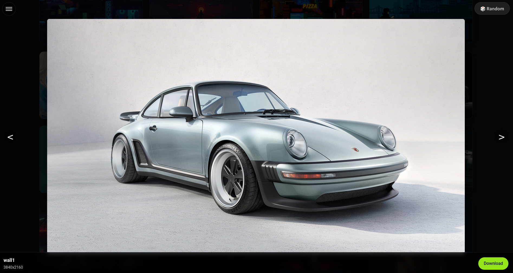
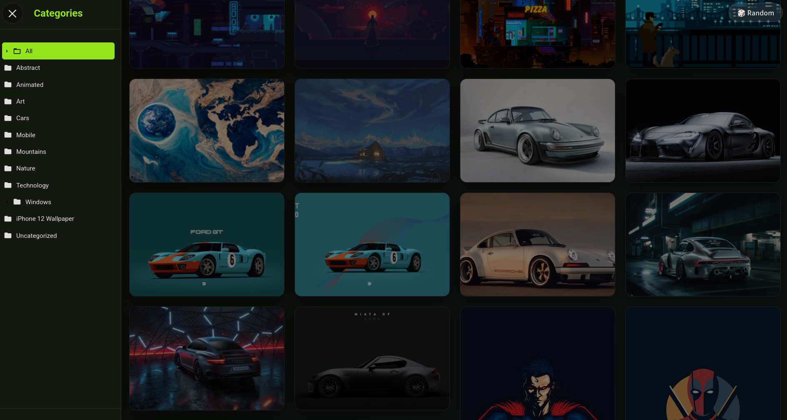

<div align="center">
  <h1>Wallpaper Gallery</h1>
  <p>A curated collection of stunning wallpapers, fully automated and ready for deployment.</p>
</div>

## 📸 Screenshots

<div align="center">
  
  
  
</div>

## ✨ Live Demo

You can view the live wallpaper gallery hosted from this repository here: **[Live Gallery](https://wallsite.vercel.app/)**

---

## 🚀 Create Your Own Gallery

Ready to build your own gallery? Click the button below to generate a new repository from the template. You'll get a clean copy of the project with an empty `src` folder, ready for your wallpapers and deployment.

<div align="center" style="margin-top: 20px; margin-bottom: 20px;">
  <a href="https://github.com/Rishabh5321/wallsite-template/generate" style="text-decoration: none;">
    
  </a>
</div>

After you create your repository, follow the simple deployment instructions in your new repository's `README.md` file.

---

## 🔧 Advanced Use: Self-hosting with Docker

For users who want to host the gallery on their own server, a pre-built Docker image is available.

<div align="center">
    <a href="docker-compose.yml" title="View docker-compose.yml"></a>
</div>

1.  **Pull the Docker Image:**
    ```bash
    docker pull ghcr.io/rishabh5321/wallsite:latest
    ```

2.  **Run the Container:**
    Run the Docker container, making sure to mount your local `src` directory (filled with your wallpapers) into the container at `/app/src`.
    ```bash
    docker run -d -p 8000:8000 \
      -v /path/to/your/wallpapers/src:/app/src \
      --name my-wallsite \
      ghcr.io/rishabh5321/wallsite:latest
    ```
    Your gallery will be running at `http://localhost:8000`.

## License

The code in this repository is licensed under the MIT License. See the [LICENSE](LICENSE) file for details. Wallpapers are not covered by this license.